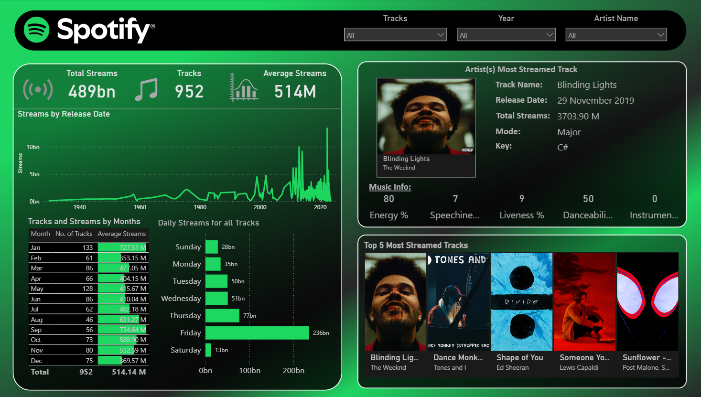

# 🎵 Spotify Streaming Insights Dashboard

 
 
 


## 📌 Overview
This project leverages the **Spotify Web API**, **Python**, and **Power BI** to analyze Spotify track data and deliver a fully interactive music insights dashboard.  
It visualizes key performance metrics, trends, and track-level details, complete with album cover integration for a more engaging user experience.

The dataset was sourced from Kaggle: [**Most Streamed Spotify Songs 2023**](https://www.kaggle.com/datasets/nelgiriyewithana/top-spotify-songs-2023)

---

## 🚀 Features

### **Data Acquisition & Processing**
- Sourced dataset from Kaggle containing track metadata & streaming stats.
- Pulled **album cover URLs** from Spotify Web API using Python.
- Merged cover art into the dataset for visual context.
- Imported and **preprocessed data in Power BI** (cleaning, transformations, calculated columns, and measures).

### **Dashboard Highlights**
- **KPIs**:  
  - Total Streams  
  - Total Tracks  
  - Average Streams per Track  
- **Trend Analysis**:  
  - Line chart for *Streams by Release Date*  
  - Table showing *Tracks & Streams by Month*  
  - Bar chart showing *Daily Streams for All Tracks*
- **Track Deep Dive**:  
  - Artist’s most streamed track with:
    - Track Name  
    - Release Date  
    - Total Streams  
    - Mode & Key  
    - Album Cover  
- **Audio Feature Breakdown** *(for selected track)*:
  - Energy %  
  - Speechiness %  
  - Liveness %  
  - Danceability %  
  - Instrumentalness %  
- **Top Tracks Slicer**:  
  - Displays album covers of the **Top 5 Most Streamed Tracks** for quick selection.
- **Filters**:
  - Track  
  - Year  
  - Artist Name  

---

## 🛠️ Tools & Technologies
- **Python**:  
  - Requests (Spotify Web API calls)  
  - Pandas (data handling)
- **Spotify Web API**:  
  - Fetching album covers & metadata
- **Power BI Desktop**:  
  - Data preprocessing  
  - DAX calculations  
  - Interactive visuals & slicers

---

## 📸 Dashboard Preview
[](SpotifyDB.png)

---

## 📈 Insights & Learnings
- Integrated **external API data** (Spotify Web API) into an existing dataset.
- Enhanced visual storytelling in **Power BI** with album cover images.
- Built **interactive dashboards** with KPIs, charts, and slicers.
- Applied DAX and formatting techniques for a polished analytics experience.

---

## 🔑 How to Run This Project
1. Clone this repository:
   ```bash
   git clone https://github.com/sh-kartik18/Spotify-Dashboard.git
2. Download the dataset from Kaggle.
3. Fetch your Spotify API credentials from Spotify Developer Dashboard.
4. Run get_album_covers.py to enrich your dataset with album covers.
5. Open the .pbix file in Power BI Desktop.
6. Interact with the dashboard!

---

## 📜 License
This project is licensed under the MIT License — feel free to use and modify.

---

Author: Kartik Sharma
